# DevOps_Home_Work (given by Mr. Vimal Daga sir)

## Video Demonstration : https://youtu.be/HR_qIhqFyb8

## Work Description :

  ### In this work I created one system in which there are two environments created using docker. One for testing and one for production. Both are controlled by jenkins.  Now in our local git system we are using one branch for testing called "dev". Our master branch is connected with Production environment. And dev branch is connected with Testing environment. Here we have only two manual works:
  * 1st : We have to manually commit after we do any implementation in 'dev' branch in git.
  * 2nd : We have to manually check as a Quality Assurance Team guy that our 'dev' branch implementation is working fine or not in testing environment. If it's working fine then 1 click and our website will be automatically get updated in Production Environment and will be publicly available.
  
### Pre-requisite :
  * OS: Base OS is Windows 10. Server OS is RedHat Enterprise Linux 8 (RHEL8) in Virtual Box.
  * In RHEL8 some of the softwares needed are Docker (also need the httpd image downloaded in it), Jenkins (also github plugin should be installed in it), ngrok program.
  * In Windows we need git bash software.
  * At the starting stop the firewalld in RHEL8 and start the docker and jenkins services.

## Let's see step by step how to achieve this :
  
### 1. Giving Jenkins all the power of Linux :

  * Edit the `sudoers` file using : `gedit /etc/sudoers` in your RHEL8. Follow the below pic and add the highlighted lines.
  
  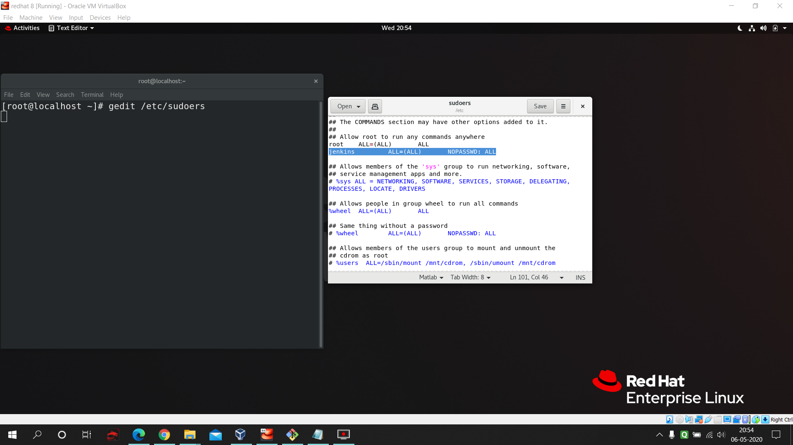
  
### 2. Creating the git repository :

  * You have to create one git repo with 2 branches one master and one developer. You can see the below pictures for reference.
  
#### On the below mentioned pic I created one master branch and uploaded my files in GitHub.

  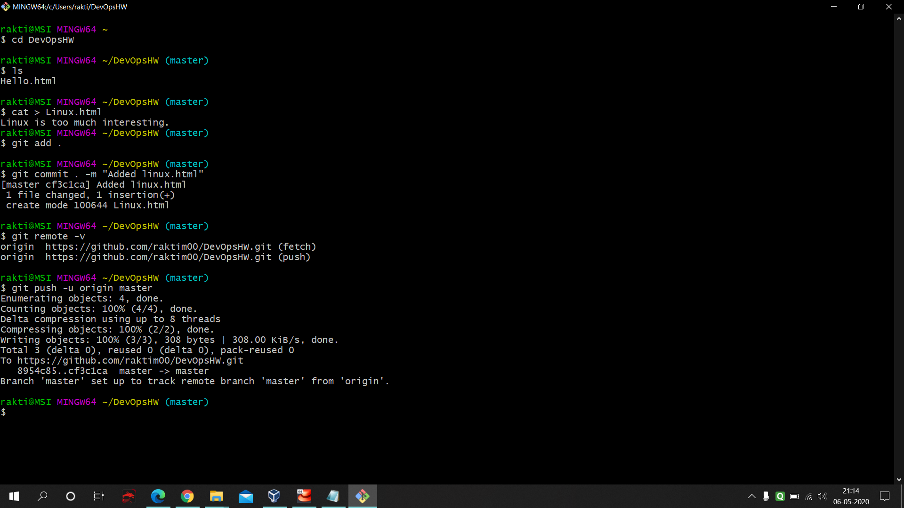
  
#### Next I created the 'dev' branch and started implementing my file in it.

  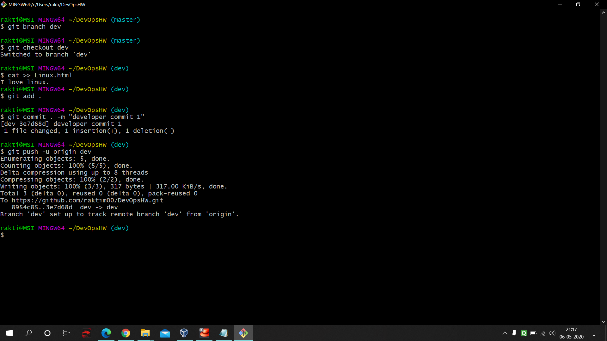
 
### 3. Creating the Production Job in Jenkins :

#### Follow the below mentioned picture and build the 1st job in Jenkins. This job is for Production Unit. This Job will pull the data from master branch and store it inside one folder.

 * Go to the 'configure' of your job and fill these data. First give the URL of your project repository. Next in SCM select git and fill the repo URL and select the branch to master.
 
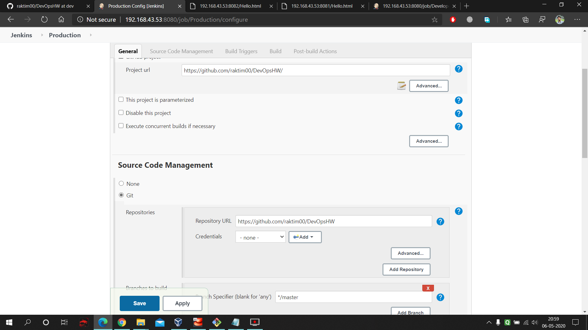

 * Next go to the PollSCM and enter 5 starts with space in between them. This means in each minutes our Jenkins will keep checking the GitHub master branch and whenever any thing gets updated it will fetch that data. Next command run on the RHEL8 by jenkins which stores the master branch data into the production folder. Here is the command used in the execute shell of Production :
 https://github.com/raktim00/DevOps_Home_Work/blob/master/Production_execute_shell_code
 
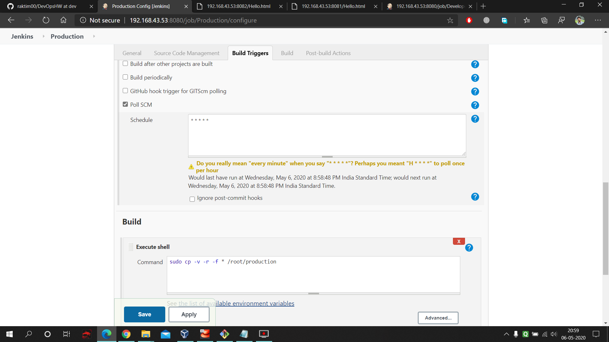

### 4. Creating the Production Deployment Job in Jenkins :

 * Here at first we have to select build trigger and then "Build after other project build" option and have to provide the production job name. This means as soon as Production Job completes The Deployment Job will start automatically. Next we have to provide a Linux code which gonna start our deployment docker environment. In this code we are allowing the docker container to fetch the data from our production folder where we are pulling our master branch data. Next we are allowing PATing so that we can connect to the container from outside of RHEL8 using port number 8082. Here is the command used in the execute shell of Production Deployment : https://github.com/raktim00/DevOps_Home_Work/blob/master/Production_Deploy_Execute_shell_code
 
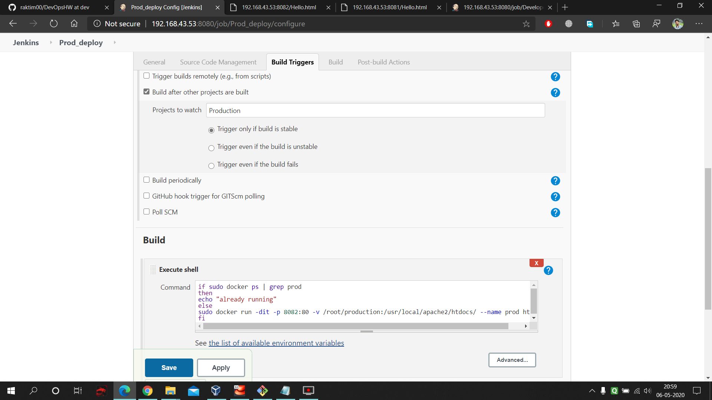

### 5. Creating the Developer Job in Jenkins :

 * Same concept as Production Job. Only difference is select the branch to 'dev'.
 
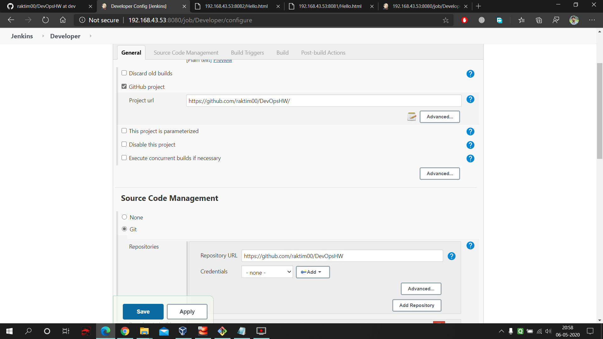

 * Here also same concept only difference is here we select the Remote Trigger in Build Trigger cause using this we can trigger this job to work remotely as soon as we commit and push in our local git. Plus one thing here we are saving the files in Developer folder. Here is the command used in the execute shell of Developer : https://github.com/raktim00/DevOps_Home_Work/blob/master/Developer_execute_shell_code
 
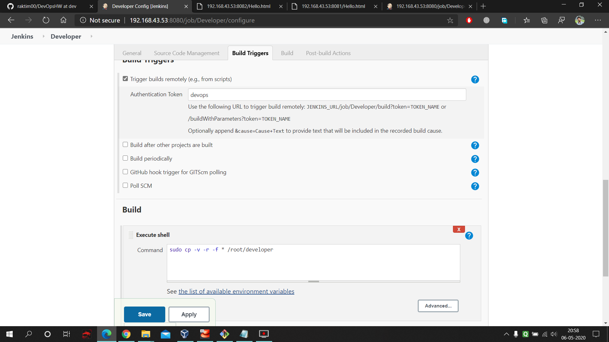

### 6. Creating the Developer Deployment Job in Jenkins :

 * Exactly same concept as previous cause we want the same environment as like Production Deployment. Only difference is here we changed the "Build after other project build" option to 'developer' and a little bit of change in build execute shell to start a new container. Here is the command used in the execute shell of Developer Deployment : https://github.com/raktim00/DevOps_Home_Work/blob/master/Developer_Deploy_Execute_shell_code
 
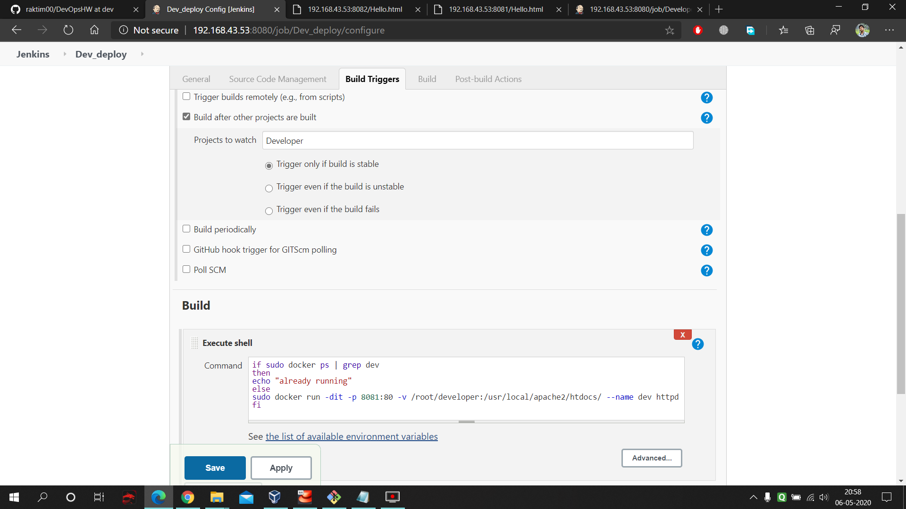

### 7. Final job of Merging in Jenkins :

 * This is the button which we will use after testing our data in testing environment. This build gonna merge the 'dev' branch data into 'master' branch. And after that we don't have to worry cause within one minute Jenkins Production job and then Production Deployment job gonna make our thing available to use for public.
 
 * Here also same pervious concept only difference is just you have to provide jenkins your github credential otherwise it's not gonna be able to push our code after merging.
 
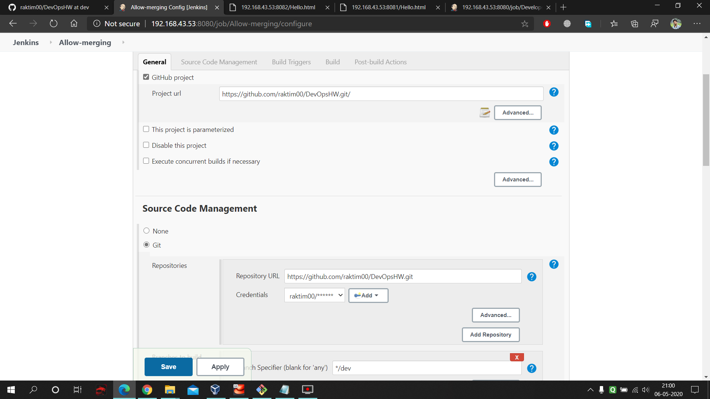

 * Next give anything in build but remember that should execute otherwise jenkins not gonna work post-build which will do the merging. Here is the command used in the execute shell of Merging : https://github.com/raktim00/DevOps_Home_Work/blob/master/Allow_merge_execute_shell_code 
 
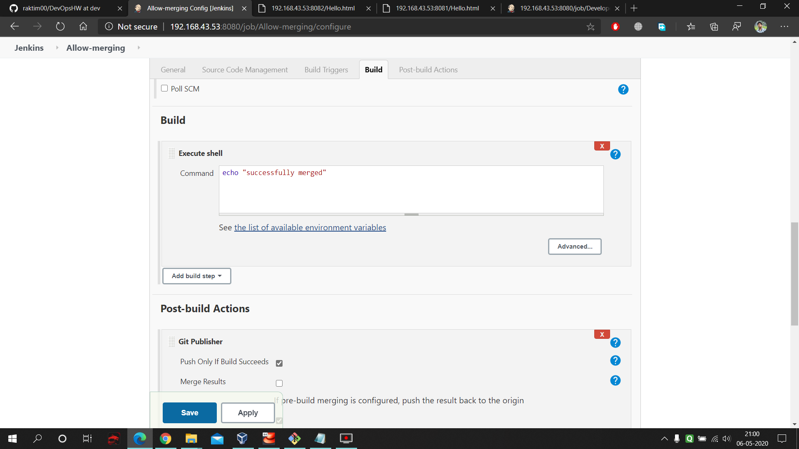

 * Lastly select the post-build which gonna do the merging and fill the below mentioned boxes.
 
 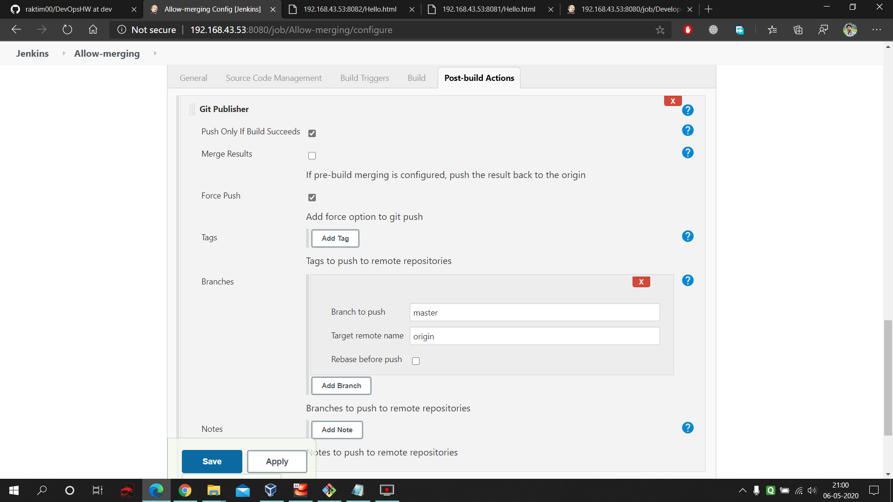
 
### 8. Lastly one work in git :
 
 * You have to configure the git commit command for your 'dev' branch. Using this we gonna achieve two thing as soon as we commit :
   1. As soon as we commit 'git push' will automatically happen.
   2. Remotely our git bash gonna trigger the Developer Job in Jenkins. 

 For that go inside you `.git/hooks` folder and follow the below command to create the post-commit file.

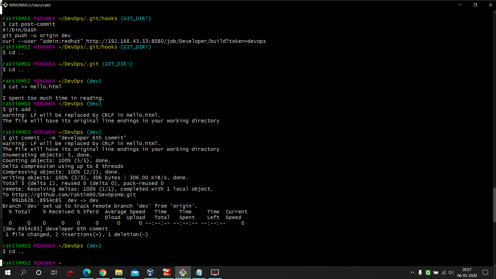

## Now it's time to test the things :

### 1st Observing the Production and Testing Environment at the initial stage.

 * At port 8082 we have production environment. Initially both production and testing environment have the same data.

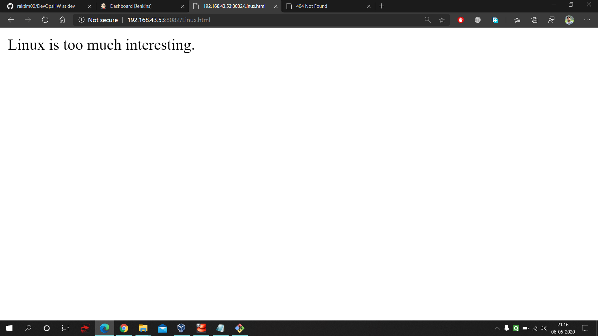

 * Next we added few data in our 'dev' branch and commit. As post-commit is pre-configured that's we don't need to push or don't need to pull the trigger of jenkins. Here you can once again see the post-commit file's internal code.

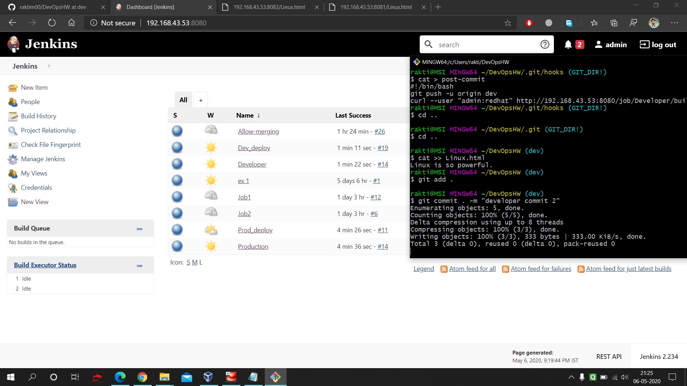
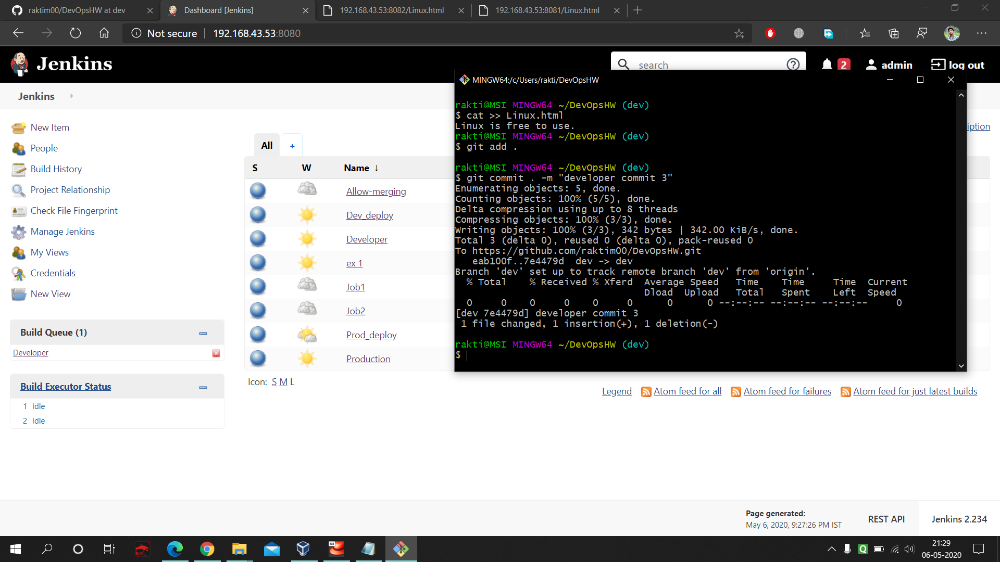

 * On port no. 8081 our new updated 'dev' branch code is visible.

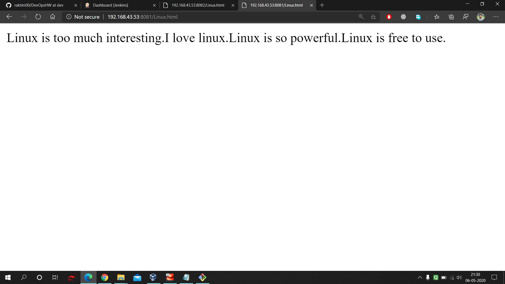

 * Now as we can see that everything is working fine so now we can pull the trigger for the merging and this gonna merge our 'dev' branch data into master branch. 

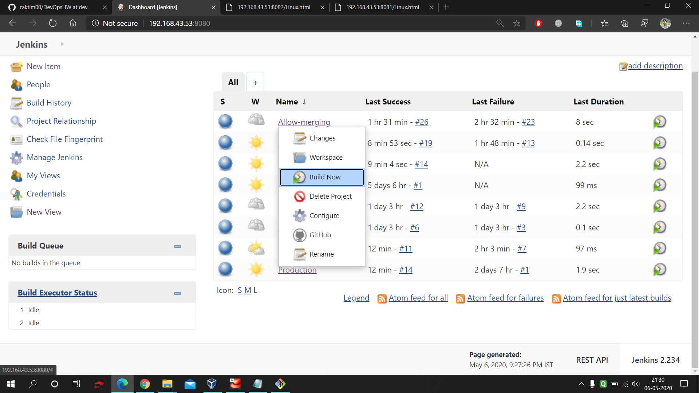

 * Plus as our Jenkins Production Job keep on checking the master branch per minute so within 1 minute we can see that on port 8082 our webpage gets updated.

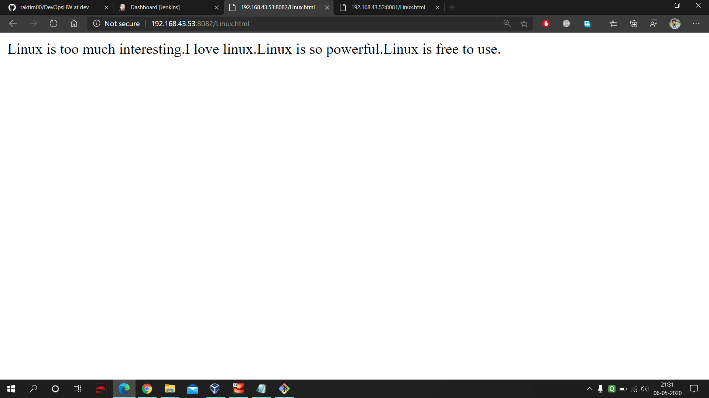

#### Lastly one great thing without purchasing any public IP if you want to make your website available for public then use this ngrok program in linux.

 * Firstly use `./ngrok http 8082` command in that particular folder where your ngrok program is located. Remember here I used httpd webserver and I allow 8082 port for production. 

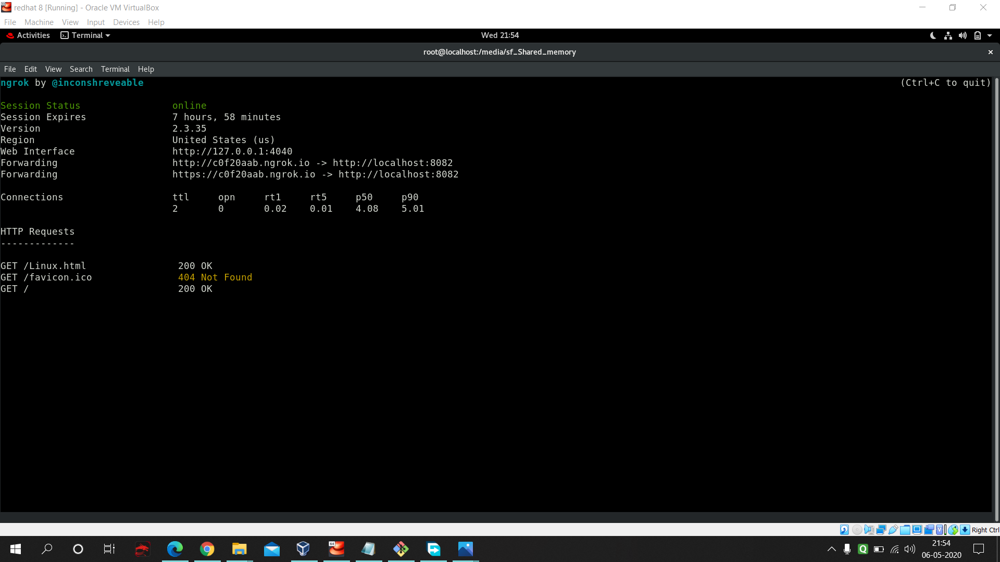

 * Go to any browser in the world which is connected to internet and paste the website address provided by ngrok and you will be able to see it.

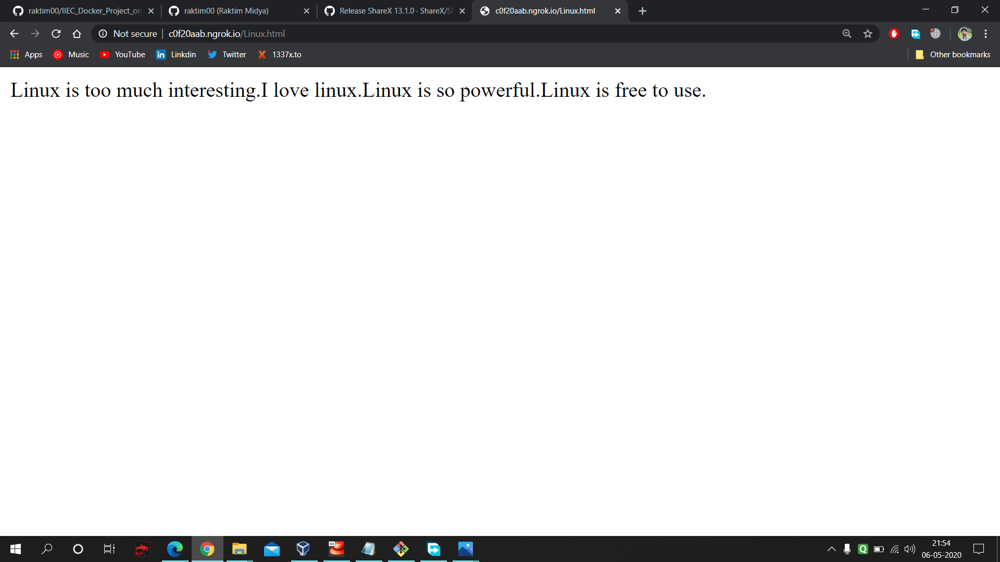

## Future possibilities :

 #### In future we can integrate the same concept in Cloud Services and in Hybrid Cloud.
 #### Second thing we can use more great tools like Ansible Scripting to create more great environment.
 #### Third we can create distributed setup on our own and can host our website on our own.

## Thank you so much Vimal Sir for teaching us these kinds of great technologies.
